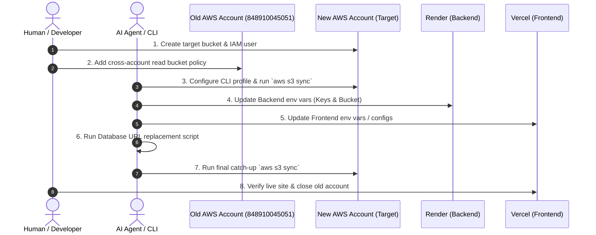

# 🚀 AWS S3 Cross-Account Migration Guide (`aws_shift.md`)

> **Document Purpose:**  
> This document is an end-to-end, self-contained migration specification designed for **Developers** and **AI Agents**. It outlines the exact procedure to migrate S3 media storage from an old AWS account to a new AWS account without data loss or application disruption.

---

## 📌 1. Project Context & Architecture

| Component | Current Host / Configuration | Details |
| :--- | :--- | :--- |
| **Old AWS Account ID** | `848910045051` | Account where credits were exhausted |
| **Old S3 Bucket** | `boutique-media-848910045051-hyd` | Source bucket containing existing media |
| **Old AWS Region** | `ap-south-2` (Hyderabad) | Region of the old bucket |
| **New AWS Account ID** | `<NEW_ACCOUNT_ID>` *(e.g. 12-digit AWS Account ID)* | Target AWS account with active credits |
| **New S3 Bucket** | `boutique-media-<NEW_ACCOUNT_ID>-hyd` *(or chosen name)* | Target bucket to receive all media |
| **New AWS Region** | `ap-south-2` *(or preferred region, e.g., `ap-south-1`)* | Target bucket region |
| **Backend API** | **Render** | Node.js/Express API (`apps/api`) |
| **Frontend** | **Vercel** | React / Vite Single Page App (`apps/super-admin`) |
| **Upload Flow** | **S3 Pre-signed URLs** | Frontend requests pre-signed URL $\rightarrow$ Uploads direct to S3 $\rightarrow$ Backend stores public URL |

---

## 👥 2. Roles & Responsibility Breakdown



---

## 🛠️ 3. Step-by-Step Execution Plan

### 🔷 Phase 1: Human / User Steps in AWS Console (Browser)

#### Step 1.1: In the **NEW AWS Account**
1. **Create Target S3 Bucket:**
   * Go to **AWS Console $\rightarrow$ S3 $\rightarrow$ Create bucket**.
   * **Bucket name:** `boutique-media-<NEW_ACCOUNT_ID>-hyd` *(must be globally unique)*.
   * **Region:** `ap-south-2` (Hyderabad) or `ap-south-1` (Mumbai).
   * **Object Ownership:** Select **Bucket owner enforced (recommended)** *(Critical: ensures your new account owns all copied files)*.
   * **Block Public Access:** Uncheck *Block all public access* if public read access is used for storefront images.
   * Click **Create bucket**.

2. **Configure CORS on New Bucket:**
   * Go to `my-new-bucket` $\rightarrow$ **Permissions** tab $\rightarrow$ **Cross-origin resource sharing (CORS)** $\rightarrow$ **Edit**:
   ```json
   [
     {
       "AllowedHeaders": ["*"],
       "AllowedMethods": ["GET", "PUT", "POST", "DELETE", "HEAD"],
       "AllowedOrigins": ["*"],
       "ExposeHeaders": ["ETag"]
     }
   ]
   ```

3. **Configure Public Read Policy (if images are public):**
   * In **Bucket policy**, paste:
   ```json
   {
     "Version": "2012-10-17",
     "Statement": [
       {
         "Sid": "PublicReadGetObject",
         "Effect": "Allow",
         "Principal": "*",
         "Action": "s3:GetObject",
         "Resource": "arn:aws:s3:::<NEW_BUCKET_NAME>/*"
       }
     ]
   }
   ```

4. **Create IAM User & API Credentials for Backend / CLI:**
   * Go to **IAM $\rightarrow$ Users $\rightarrow$ Create user** (e.g., `boutique-backend-prod`).
   * Attach policy directly: `AmazonS3FullAccess`.
   * Open the created user $\rightarrow$ **Security credentials** tab $\rightarrow$ **Create access key** $\rightarrow$ select **CLI**.
   * Copy and save:
     * `AWS_ACCESS_KEY_ID` (e.g., `AKIA...`)
     * `AWS_SECRET_ACCESS_KEY` (e.g., `wJalr...`)

---

#### Step 1.2: In the **OLD AWS Account (848910045051)**
1. Go to **AWS Console $\rightarrow$ S3 $\rightarrow$ `boutique-media-848910045051-hyd`**.
2. Go to **Permissions** tab $\rightarrow$ **Bucket policy** $\rightarrow$ **Edit**.
3. Paste the following policy granting the new account read access:
```json
{
  "Version": "2012-10-17",
  "Statement": [
    {
      "Sid": "AllowNewAccountCrossAccountRead",
      "Effect": "Allow",
      "Principal": {
        "AWS": "arn:aws:iam::<NEW_ACCOUNT_ID>:root"
      },
      "Action": [
        "s3:GetObject",
        "s3:GetObjectAcl",
        "s3:ListBucket"
      ],
      "Resource": [
        "arn:aws:s3:::boutique-media-848910045051-hyd",
        "arn:aws:s3:::boutique-media-848910045051-hyd/*"
      ]
    }
  ]
}
```
*(Replace `<NEW_ACCOUNT_ID>` with the 12-digit ID of your new AWS account).*

---

### 🔷 Phase 2: Agent / CLI Steps on Local Laptop

*No files need to be downloaded to local hard drive; AWS S3 transfers directly across buckets over the AWS backbone.*

#### Step 2.1: Configure AWS CLI with New Account Profile
```bash
aws configure --profile new-account
# Input:
# AWS Access Key ID: <NEW_AWS_ACCESS_KEY_ID>
# AWS Secret Access Key: <NEW_AWS_SECRET_ACCESS_KEY>
# Default region name: ap-south-2
# Default output format: json
```

#### Step 2.2: Execute Initial Cross-Account S3 Sync
```bash
aws s3 sync s3://boutique-media-848910045051-hyd s3://<NEW_BUCKET_NAME> --profile new-account
```
> **Note:** If connection drops or stops, re-running the exact same command will safely resume where it left off.

---

### 🔷 Phase 3: Application & Environment Updates

#### Step 3.1: Update Backend Environment Variables on Render & Local `.env`
Update `c:\Users\duddu\Downloads\web-Waas_22-09\.env` and the **Render Web Service Dashboard Environment**:

```env
# AWS S3 Storage
AWS_REGION="<NEW_AWS_REGION>"
AWS_BUCKET_NAME="<NEW_BUCKET_NAME>"
AWS_ACCESS_KEY_ID="<NEW_AWS_ACCESS_KEY_ID>"
AWS_SECRET_ACCESS_KEY="<NEW_AWS_SECRET_ACCESS_KEY>"
```

#### Step 3.2: Database Image URL Replacement
In this project, image URLs are generated and saved via `storage.service.ts`:
`https://<OLD_BUCKET>.s3.<OLD_REGION>.amazonaws.com/<KEY>`

If stored URLs contain the old bucket endpoint, execute a SQL migration on the database:
```sql
UPDATE tenants 
SET logo_url = REPLACE(logo_url, 'boutique-media-848910045051-hyd', '<NEW_BUCKET_NAME>')
WHERE logo_url LIKE '%boutique-media-848910045051-hyd%';

UPDATE products 
SET images = REPLACE(images, 'boutique-media-848910045051-hyd', '<NEW_BUCKET_NAME>')
WHERE images LIKE '%boutique-media-848910045051-hyd%';
```

#### Step 3.3: Frontend on Vercel
If `apps/super-admin` or storefront applications use Vercel environment variables or image domain white-listing:
1. Update any `NEXT_PUBLIC_S3_BUCKET` or `VITE_S3_BUCKET` environment variable on Vercel.
2. Trigger a Vercel redeployment.

---

### 🔷 Phase 4: Final Catch-Up Sync & Verification

#### Step 4.1: Catch-Up Sync
To ensure no images uploaded by users while configuring Render were missed, run one final sync:
```bash
aws s3 sync s3://boutique-media-848910045051-hyd s3://<NEW_BUCKET_NAME> --profile new-account
```

#### Step 4.2: Verification Checklist
- [ ] Open the live Vercel application in the browser.
- [ ] Check existing product, tenant, and banner images to verify they load correctly (HTTP 200).
- [ ] Perform a new image upload (e.g. upload a product image).
- [ ] Confirm in the **New AWS S3 Console** that the newly uploaded file appears in `<NEW_BUCKET_NAME>`.
- [ ] Confirm the database holds the new URL format.

#### Step 4.3: Safe Decommissioning
1. Keep the old AWS account active for **48–72 hours** as a safety fallback.
2. Once everything is confirmed stable, delete the old bucket and close the old AWS account to prevent any future billing.

---

## 🛡️ 4. Common Troubleshooting & Error Resolution

| Error / Issue | Root Cause | Solution |
| :--- | :--- | :--- |
| **`AccessDenied` on `aws s3 sync`** | Bucket policy missing in Old Account or incorrect Account ID | Verify the Bucket Policy in Account A contains the exact 12-digit ID of Account B. |
| **`AccessDenied` when viewing images in new bucket** | Object ownership mismatch or missing public policy | Enable **Bucket owner enforced** in target bucket $\rightarrow$ apply public read bucket policy. |
| **CORS error on upload from frontend** | Target bucket missing CORS rules | Add CORS JSON in Target Bucket permissions (Phase 1, Step 1.2). |
| **Broken images on live site** | Old URLs still in database or old environment variables cached | Run the SQL `REPLACE` script and trigger a manual redeploy on Render. |
